# 🛡️ AndroXploit Android Framework Tools

<p align="center">
  
  
  
  
  
  
  
</p>

<p align="center">
  <b>Deep Android forensic extraction platform</b> — 20 native C engines, Go concurrent crawler, Python orchestrator, and Bash ADB pipeline<br>
  Target: One-command total device backup extracting gigabytes of forensic data
</p>

---

## 📋 Table of Contents

- [Architecture](#-architecture)
- [Flowchart](#-flowchart)
- [The 20 C Engines](#-the-20-c-engines)
- [Tech Stack](#-tech-stack)
- [Quick Start](#-quick-start)
- [Build Instructions](#-build-instructions)
- [Usage Modes](#-usage-modes)
- [Output Structure](#-output-structure)
- [Engine Details](#-engine-details)
- [Root vs Non-Root](#-root-vs-non-root)
- [Performance](#-performance)
- [Troubleshooting](#-troubleshooting)
- [License](#-license)

---

## 🏗 Architecture

The system uses a **four-layer architecture** where each layer has a distinct responsibility:

```
┌─────────────────────────────────────────────────────────────┐
│  Layer 1: Python (Initiator)                                │
│  extractor.py — orchestrates phases, calls C engines        │
├─────────────────────────────────────────────────────────────┤
│  Layer 2: Go (Concurrent Crawler)                           │
│  ce_runner — parallel engine execution (4 at a time)        │
├─────────────────────────────────────────────────────────────┤
│  Layer 3: Bash + ADB (Transport/Deployment)                 │
│  ce_deploy.sh — build → push → run → pull → cleanup         │
├─────────────────────────────────────────────────────────────┤
│  Layer 4: 20 C Engines (Native Extraction)                  │
│  engine_01..20 — each focuses on one data category          │
│  ↳ Compiled for ARM64 via NDK, pushed to /data/local/tmp/   │
└─────────────────────────────────────────────────────────────┘
```

### Data Flow

1. **Python** loads module, resolves device, gathers device info
2. **Python** triggers C engines phase → calls **Bash** or **Go** runner
3. **Bash/Go** builds all 20 engines via **NDK** ARM64 cross-compilation
4. **ADB push** deploys binaries to `/data/local/tmp/` on device
5. **ADB shell** executes each engine — they write results to `/data/local/tmp/ce_results/`
6. **ADB pull** retrieves all extracted data back to host
7. **Python** aggregates reports, computes stats, displays rich summary

---

## 🔄 Flowchart

```mermaid
%%{init: {'theme': 'base', 'themeVariables': {
  'background': '#ffffff',
  'primaryColor': '#ffffff',
  'primaryTextColor': '#1e293b',
  'primaryBorderColor': '#334155',
  'lineColor': '#475569',
  'secondaryColor': '#f1f5f9',
  'tertiaryColor': '#f8fafc',
  'fontSize': '14px'
}}}%%

flowchart TB
    classDef phdr fill:#1e293b,stroke:#0f172a,stroke-width:2px,color:#ffffff,font-weight:bold,font-size:13px
    classDef step fill:#ffffff,stroke:#334155,stroke-width:2px,color:#1e293b,font-size:13px
    classDef sub fill:#f8fafc,stroke:#94a3b8,stroke-width:1.5px,color:#334155,font-size:12px
    classDef dec fill:#fef9c3,stroke:#ca8a04,stroke-width:2px,color:#854d0e,font-size:13px,font-weight:bold
    classDef eng fill:#eef2ff,stroke:#6366f1,stroke-width:1.5px,color:#4338ca,font-size:12px
    classDef data fill:#f0fdf4,stroke:#22c55e,stroke-width:1.5px,color:#166534,font-size:12px
    classDef out fill:#fef2f2,stroke:#ef4444,stroke-width:1.5px,color:#991b1b,font-size:12px
    classDef term fill:#1e293b,stroke:#0f172a,stroke-width:3px,color:#ffffff,font-weight:bold,font-size:14px

    START([⏩  S T A R T]):::term
    FIN([⏹  E N D]):::term

    P1["1. Python Module Loader<br/>extractor.py — orchestrates all phases"]:::step
    P2["2. Resolve ADB Device<br/>auto-detect or manual serial number"]:::step
    P3{"3. Device Connected?"}:::dec
    P4["4. Gather Device Info<br/>model • android • kernel • build • rooted"]:::step
    P5["5. Build Enabled Phase List<br/>11 categories from PHASE_CONFIG"]:::step
    P6["6. Locate C Engine Sources<br/>c_engines/engines/engine_*.c (20 files)"]:::step
    P7{"7. NDK Available?<br/>ANDROID_NDK_HOME set?"}:::dec
    P8["8a. ARM64 Cross-Compile<br/>aarch64-linux-android21-clang -Os -fPIE -static"]:::step
    P9["8b. Fallback: Host Build<br/>gcc -Os -Wall -DTARGET_HOST"]:::sub
    P10["9. Verify 20 Binaries<br/>~17KB each, statically linked"]:::step
    P11["10. Push to Device<br/>adb push → /data/local/tmp/"]:::step
    P12["11. Create Remote Output Dir<br/>mkdir /data/local/tmp/ce_results/"]:::step
    P13["12. Launch Engine Pool<br/>parallel = 4 concurrent engines"]:::step

    P14["13. Engines Access Data Sources<br/>system files • content providers • service calls • /proc/"]:::data
    P15["14. Engines Write Results<br/>JSON metadata + raw data files → ce_results/"]:::out
    P16["15. adb pull Results to Host<br/>ce_results/ → ./extracted_data/"]:::out
    P17["16. Cleanup Device<br/>rm -rf /data/local/tmp/ce_results/"]:::step
    P18["17. Aggregate All Engine Outputs<br/>parse JSON • count files • sum sizes"]:::step
    P19["18. Generate Report Files<br/>ce_aggregate_report.json • ce_summary.txt • file index"]:::step
    P20["19. Render Console Summary<br/>Rich Table • per-phase stats • total size • duration"]:::step

    subgraph E["20 C ENGINES — each reads system data, writes to ce_results/"]
        direction LR
        E01["⚙ 01 IMEI"]:::eng
        E02["⚙ 02 Contacts"]:::eng
        E03["⚙ 03 SMS"]:::eng
        E04["⚙ 04 Call Log"]:::eng
        E05["⚙ 05 WiFi"]:::eng
        E06["⚙ 06 Accounts"]:::eng
        E07["⚙ 07 WhatsApp"]:::eng
        E08["⚙ 08 Telegram"]:::eng
        E09["⚙ 09 Browser"]:::eng
        E10["⚙ 10 System"]:::eng
        E11["⚙ 11 Process"]:::eng
        E12["⚙ 12 Network"]:::eng
        E13["⚙ 13 SQLite"]:::eng
        E14["⚙ 14 Media"]:::eng
        E15["⚙ 15 Files"]:::eng
        E16["⚙ 16 Backup"]:::eng
        E17["⚙ 17 Hidden"]:::eng
        E18["⚙ 18 Device"]:::eng
        E19["⚙ 19 Keystore"]:::eng
        E20["⚙ 20 Master"]:::eng
    end

    START --> P1
    P1 --> P2
    P2 --> P3
    P3 -->|Yes| P4
    P3 -->|No — retry 90s| P3
    P4 --> P5
    P5 --> P6
    P6 --> P7
    P7 -->|Yes| P8
    P7 -->|No| P9
    P8 --> P10
    P9 --> P10
    P10 --> P11
    P11 --> P12
    P12 --> P13
    P13 --> E
    E --> P14
    P14 --> P15
    P15 --> P16
    P16 --> P17
    P17 --> P18
    P18 --> P19
    P19 --> P20
    P20 --> FIN

    linkStyle default stroke:#64748b,stroke-width:2px
```



### Execution Timeline

```mermaid
gantt
    title 20 C Engines — Extraction Timeline
    dateFormat  X
    axisFormat  %s

    section Build
    NDK Compilation (20 engines) :a1, 0, 30s

    section Push
    ADB Push (20 binaries)       :a2, after a1, 15s

    section Execution (parallel=4)
    Engine 01-04 (IMEI, Contacts, SMS, Calllog) :b1, after a2, 20s
    Engine 05-08 (WiFi, Accounts, WhatsApp, Telegram) :b2, after b1, 25s
    Engine 09-12 (Browser, System, Process, Network) :b3, after b2, 30s
    Engine 13-16 (SQLite, Media, Files, Backup) :b4, after b3, 40s
    Engine 17-20 (Hidden, Device, Keystore, Master) :b5, after b4, 20s

    section Pull
    ADB Pull Results              :c1, after b5, 20s

    section Report
    Aggregate & Display           :d1, after c1, 5s
```



---

## ⚙️ The 20 C Engines

Each engine is a **standalone ARM64 binary** (~17KB each) compiled with NDK `-Os -fPIE -static`. They run directly on the Android device as native executables.

| # | Engine | Focus | Data Sources | Root Required |
|---|--------|-------|-------------|:---:|
| 01 | `imei` | Device identifiers | `getprop`, `/proc/radio/`, `service call radio`, `dumpsys iphonesubinfo` | No |
| 02 | `contacts` | Contact database | `contacts2.db`, `content://com.android.contacts/` | No |
| 03 | `sms` | SMS/MMS messages | `mmssms.db`, `content://sms/`, `dumpsys telephony` | No |
| 04 | `calllog` | Call history | `calllog.db`, `content://call_log/calls` | No |
| 05 | `wifi` | WiFi credentials | `WifiConfigStore.xml`, `wpa_supplicant.conf`, `cmd wifi` | Yes* |
| 06 | `accounts` | Account tokens | `accounts.db`, `settings list`, `dumpsys account` | Yes* |
| 07 | `whatsapp` | WhatsApp data | `msgstore.db`, `wa.db`, `axolotl.db`, WhatsApp Business | Yes* |
| 08 | `telegram` | Telegram data | `cache4.db`, `kv.db`, Telegram X, Plus Messenger | Yes* |
| 09 | `browser` | 15 browsers | Chrome, Firefox, Edge, Brave, Opera, Samsung, MIUI, Vivaldi, DuckDuckGo... | Yes* |
| 10 | `system` | System configuration | `build.prop`, `settings`, `dumpsys` (15 services), `/proc/` | No |
| 11 | `process` | Process/memory | `/proc/[pid]/maps,environ,cmdline`, `ps`, `lsof` | Partial |
| 12 | `network` | Network state | `ip`, `netstat`, `iptables`, `/proc/net/`, MAC addresses | No |
| 13 | `sqlite` | SQLite database collector | Scans `/data/`, `/sdcard/` for all `.db`/`.sqlite` files | Yes* |
| 14 | `media` | Media scanner | Indexes JPG, PNG, MP4, MP3, HEIC and 16+ formats with metadata | No |
| 15 | `files` | Full file crawler | Recursive file index with size, permissions, mtime | No |
| 16 | `backup` | Backup creator | Copies DCIM, Documents, WhatsApp; creates `tar.gz` archive | No |
| 17 | `hidden` | Hidden/interesting files | Dotfiles, large files >50MB, files with password/credential/key patterns | No |
| 18 | `device` | Hardware/partitions | `/dev/block/`, `/proc/partitions`, CPU, GPU, battery, display | No |
| 19 | `keystore` | Credential storage | Gatekeeper keys, VPN configs, credential providers, appops | Yes* |
| 20 | `master` | Orchestrator | Runs engines 01-19, aggregates JSON results, produces summary | — |

> **\*** Root enhances access significantly, but engines fall back to world-readable paths and content providers when root is unavailable.

---

## 🛠 Tech Stack

| Technology | Version | Role |
|------------|---------|------|
| **C (C99)** | ARM64 | 20 native extraction engines |
| **Go** | 1.21+ | Concurrent runner with parallel/semaphore execution |
| **Python** | 3.8+ | Module orchestrator with Rich console output |
| **Bash** | 5.0+ | ADB deployment pipeline |
| **Android NDK** | r27 | ARM64 cross-compilation (`aarch64-linux-android21-clang`) |
| **ADB** | 39.0+ | Device communication (push/shell/pull) |
| **Android** | 15 (SDK 35) | Target platform |

### Key Libraries

- **C**: No external dependencies — statically linked, musl-compatible
- **Go**: Standard library only
- **Python**: `rich` (console UI), `json`, `subprocess`, `concurrent.futures`
- **Bash**: Coreutils, adb

---

## 🚀 Quick Start

### Prerequisites

```bash
# Required
adb --version                          # Android Debug Bridge ≥ 39.0
python3 --version                      # Python ≥ 3.8
pip install rich                       # Rich console library

# For ARM64 cross-compilation (recommended)
export ANDROID_NDK_HOME=/path/to/ndk   # NDK r27+

# For testing on host (no device needed)
gcc --version                          # Host GCC
```

### One-Command Run

```bash
# Clone and enter
git clone <repo> && cd AndroXploit

# Connect device
adb devices

# Option A: Python module (full orchestrator)
python3 -c "
from modules.exploit.extractor import Module
m = Module()
m.run()
"

# Option B: Bash deploy script
bash scripts/ce_deploy.sh

# Option C: Go concurrent runner
cd golang/ce_runner && go run . -device $(adb devices | grep device | head -1 | awk '{print $1}')
```

### Build + Deploy + Run (Step by Step)

```bash
# 1. Build all 20 engines for ARM64
cd c_engines/engines && make all

# 2. Push to device
make install SERIAL=your_device_serial

# 3. Run on device
make run SERIAL=your_device_serial

# 4. Pull results
adb pull /data/local/tmp/ce_results ./my_extraction

# 5. View results
ls -la ./my_extraction/
```

---

## 🔧 Build Instructions

### NDK Cross-Compilation (ARM64 — for device)

```bash
export ANDROID_NDK_HOME=/opt/android-ndk-r27

cd c_engines/engines
make all                    # Build all 20 engines
```

The Makefile uses: `aarch64-linux-android21-clang -Os -fPIE -static -Wall`

### Host Compilation (x86_64 — for testing)

```bash
cd c_engines/engines
make all_host               # Build with host gcc
```

### Individual Engine Build

```bash
cd c_engines/engines/build
aarch64-linux-android21-clang -Os -fPIE -static -o engine_01_imei ../engine_01_imei.c -I..
```

### Clean Build

```bash
cd c_engines/engines && make clean
```

---

## 🎮 Usage Modes

### Mode 1: Python Module (Full Orchestration)

```bash
use exploit/extractor

# Configure
set DEVICE_SERIAL your_serial    # Optional: auto-detect if not set
set OUTPUT_DIR ./extracted_data  # Output directory
set PULL_TIMEOUT 600             # ADB pull timeout in seconds

# Toggle phases (all enabled by default)
set EXTRACT_IMEI true
set EXTRACT_COMMUNICATIONS true
set EXTRACT_C_ENGINES true       # Deploys and runs 20 C engines

# Run
run
```

### Mode 2: Go Concurrent Runner

```bash
cd golang/ce_runner

go run . \
  -device your_serial \
  -output ./ce_aggregate \
  -parallel 4 \
  -verbose

# Flags:
#   -device     ADB serial (auto-detect if empty)
#   -output     Local output directory (default: ./ce_aggregate)
#   -remote     Remote temp directory on device (default: /data/local/tmp)
#   -parallel   Concurrent engines (default: 4)
#   -skip-build Skip NDK build if binaries already exist
```

### Mode 3: Bash Deploy Script

```bash
SERIAL=your_serial bash scripts/ce_deploy.sh

# Or auto-detect:
bash scripts/ce_deploy.sh
```

---

## 📁 Output Structure

```
ce_aggregate/
├── ce_aggregate_report.json        # Full JSON report (machine-readable)
├── ce_summary.txt                  # Human-readable summary
├── ce_results/                     # Raw engine output
│   ├── imei/                       # Engine 01
│   │   ├── imei_oem1.txt
│   │   ├── imei_oem2.txt
│   │   ├── serialno.txt
│   │   └── ...
│   ├── contacts/                   # Engine 02
│   │   ├── contacts2.db
│   │   ├── raw_contacts.txt
│   │   └── ...
│   ├── sms/                        # Engine 03
│   ├── calllog/                    # Engine 04
│   ├── wifi/                       # Engine 05
│   ├── accounts/                   # Engine 06
│   ├── whatsapp/                   # Engine 07
│   ├── telegram/                   # Engine 08
│   ├── browser/                    # Engine 09
│   ├── system/                     # Engine 10
│   ├── process/                    # Engine 11
│   ├── network/                    # Engine 12
│   ├── sqlite/                     # Engine 13
│   ├── media/                      # Engine 14
│   │   ├── media_index.csv
│   │   └── ...
│   ├── files/                      # Engine 15
│   │   ├── files_index.csv
│   │   └── ...
│   ├── backup/                     # Engine 16
│   │   ├── sdcard_backup.tar.gz
│   │   └── ...
│   ├── hidden/                     # Engine 17
│   │   ├── hidden_index.csv
│   │   └── ...
│   ├── device/                     # Engine 18
│   ├── keystore/                   # Engine 19
│   └── master/                     # Engine 20
│       ├── master_report.json
│       └── summary.txt
├── .engine_01.json                 # Per-engine JSON metadata
├── .engine_02.json
├── ...
└── 00_FILE_INDEX.txt               # Complete file listing
```

---

## 🧩 Engine Details

### Engine 01 — IMEI Extractor

**Purpose**: Extract all device identifiers — IMEI1, IMEI2, MEID, Serial Number, Android ID

**Data Sources**:
- `getprop ro.ril.oem.imei1`, `ro.ril.oem.imei2`, `ro.phone.imei`, `gsm.baseband.imei`
- `/proc/radio/` — reads all radio-related proc entries
- `service call radio 1..5` — low-level RIL interface queries
- `dumpsys iphonesubinfo` — subscription info
- `settings get secure android_id`

**Fallback Chain**: `getprop` → `service call` → `dumpsys` → `/proc/radio/`

### Engine 02 — Contacts Extractor

**Purpose**: Extract full contacts database, raw contacts, and vCard export

**Data Sources**:
- `/data/data/com.android.providers.contacts/databases/contacts2.db`
- `content://com.android.contacts/data` — content provider projection
- `content://com.android.contacts/raw_contacts`
- vCard export via contacts content provider

**Fallback Chain**: Content provider → database copy (root) → strings extraction

### Engine 03 — SMS/MMS Extractor

**Purpose**: Extract SMS inbox, sent, drafts, MMS messages

**Data Sources**:
- `/data/data/com.android.providers.telephony/databases/mmssms.db`
- Content providers: `content://sms/`, `content://sms/inbox`, `content://sms/sent`, `content://mms/`
- `dumpsys telephony.registry`

### Engine 04 — Call Log Extractor

**Purpose**: Extract call history — incoming, outgoing, missed calls with timestamps

**Data Sources**:
- `/data/data/com.android.providers.contacts/databases/calllog.db`
- `content://call_log/calls`
- `dumpsys dropbox` — filtered for call events

### Engine 05 — WiFi Credential Extractor

**Purpose**: Extract saved WiFi networks, passwords, PSK, MAC addresses

**Data Sources**:
- `/data/misc/wifi/WifiConfigStore.xml` — contains SSID + PSK
- `/data/misc/wifi/wpa_supplicant.conf`
- `cmd wifi list-networks`
- `dumpsys wifi` — filtered for SSID/Key/Password/psk
- `/sys/class/net/wlan*/address` — MAC addresses

### Engine 06 — Account Extractor

**Purpose**: Extract all registered accounts, authenticators, sync settings

**Data Sources**:
- `accounts.db` — all user accounts with tokens
- `settings list global/secure/system` — account-related settings
- `dumpsys account`, `dumpsys user`
- `pm query-services --user 0 android.accounts.AccountAuthenticator`

### Engine 07 — WhatsApp Extractor

**Purpose**: Extract WhatsApp message databases, media, and configuration

**Data Sources**:
- `/data/data/com.whatsapp/databases/msgstore.db` — all messages
- `wa.db` — WhatsApp contacts
- `axolotl.db` — encryption keys
- `/storage/emulated/0/WhatsApp/Databases/` — backup databases
- Also scans for WhatsApp Business (`com.whatsapp.w4b`)

### Engine 08 — Telegram Extractor

**Purpose**: Extract Telegram message databases and media references

**Data Sources**:
- `/data/data/org.telegram.messenger/databases/cache4.db`
- `kv.db` — key-value store (may contain session data)
- Shared preferences and config files
- Telegram X (`org.telegram.messenger.web`)
- Plus Messenger (`com.plusmessenger`)
- `/storage/emulated/0/Telegram/` — media files

### Engine 09 — Browser Extractor

**Purpose**: Extract history, bookmarks, logins, cookies from 15+ browsers

**Supported Browsers**:
Chrome, Chrome Beta, Chromium, Brave, Opera, Opera Mini, Firefox, Edge, DuckDuckGo, Vivaldi, AOSP Browser, Samsung Internet, Samsung Internet Legacy, MIUI Browser, WebView

**Data Extracted**:
- `WebView.db` — form data
- `History.db` — browsing history
- `LoginData` — saved credentials
- `Cookies` — session cookies
- `Bookmarks` — bookmarks
- `Favicons` — site icons
- `Autofill` — autofill data
- Shared preferences (XML)

### Engine 10 — System Dumper

**Purpose**: Complete system configuration dump

**Data Sources**:
- `getprop` — all 500+ system properties
- `/system/build.prop`, `/vendor/build.prop`, `/product/build.prop`
- `settings list global/secure/system`
- 15 `dumpsys` services: battery, connectivity, netstats, window, power, diskstats, wifi, bluetooth_manager, telephony.registry, appops, notification, activity, package, permission, backup
- `/proc/version`, `/proc/cpuinfo`, `/proc/meminfo`, `/proc/mounts`, `/proc/partitions`
- `packages.xml`, `packages.list`, `device_policies.xml`

### Engine 11 — Process Scanner

**Purpose**: Dump process list and per-process memory/status information

**Data Sources**:
- `ps -A` — full process list with PID, PPID, user
- `ps -AT` — thread list
- `/proc/[pid]/cmdline`, `status`, `environ`, `oom_score`, `maps`, `limits`, `cgroup`
- `dumpsys activity`, `dumpsys process`, `dumpsys app`
- `service list` — all registered services
- `lsof` — open file descriptors

### Engine 12 — Network Dumper

**Purpose**: Complete network state — interfaces, connections, routing, DNS, firewall

**Data Sources**:
- `/sys/class/net/*/address` — MAC for all interfaces
- `ip addr`, `ip route`, `ip neigh`, `ip link`
- `netstat -anep`, `ss -anep` — all connections
- `/proc/net/tcp`, `/proc/net/tcp6`, `/proc/net/udp`, `/proc/net/unix`
- `/proc/net/arp` — ARP cache
- `iptables -L -n` — firewall rules
- `cat /proc/net/wireless` — wireless info
- `dumpsys connectivity`, `dumpsys ethernet`

### Engine 13 — SQLite Collector

**Purpose**: Find and copy ALL SQLite databases on the device

**Approach**:
1. Scans `/data/data/` (every app package) for `.db`/`.sqlite`/`.sqlite3` files
2. Verifies each file has SQLite magic header (`SQLite format 3\x00`)
3. Copies to output with flattened path names
4. Scans up to 8 directories deep, skips `/proc/`, `/sys/`, `/dev/`

**File size limits**: >100 bytes, <500MB

### Engine 14 — Media Scanner

**Purpose**: Index all media files with metadata (no copying — avoids multi-GB transfers)

**Supported Formats**:
- **Images**: JPG, JPEG, PNG, GIF, WEBP, HEIC, HEIF
- **Video**: MP4, MKV, 3GP, WEBM, MOV, AVI
- **Audio**: MP3, WAV, AAC, OGG, FLAC

**Output**: `media_index.csv` — filename, size, full path, mtime

### Engine 15 — File Crawler

**Purpose**: Full recursive file index with metadata

**Output**: `files_index.csv` — path, size, permissions (octal), mtime

**Scope**: `/sdcard/`, `/storage/emulated/0/`, Android data/obb/media directories

**Root mode**: Additionally indexes `/data/data/`, `/data/system/`, `/data/misc/`

### Engine 16 — Backup Creator

**Purpose**: Create actual backup copies and tar.gz archive

**Copy Strategy**: Copies directories (max depth 4, max file size 100MB):
- `/sdcard/DCIM/` — photos/videos
- `/sdcard/Documents/` — documents
- `/sdcard/Download/` — downloads
- `/sdcard/Pictures/` — pictures
- `/sdcard/WhatsApp/` — WhatsApp media
- `/sdcard/Telegram/` — Telegram media
- `TitaniumBackup/`, `SwiftBackup/` — app backups

**Archive**: Creates `sdcard_backup.tar.gz` via busybox `tar`

### Engine 17 — Hidden File Detector

**Purpose**: Find hidden files and security-relevant files

**Detection Rules**:
- Dotfiles (`.` prefix)
- Files matching interesting names: `backup`, `password`, `credential`, `token`, `secret`, `key`, `private`, `vpn`, `wallet`, `crypto`, `bank`, `pin`, `auth`, `.git`, `.ssh`, `.gnupg`, `.pgp`
- Large files >50MB
- Copies interesting files <1MB to output

### Engine 18 — Device Scanner

**Purpose**: Hardware and partition enumeration

**Data Sources**:
- `/dev/block/*` — all block devices with major/minor numbers
- `/proc/partitions`, `/proc/diskstats`, `/proc/mounts`
- `df -h` — disk usage
- `/sys/class/kgsl/` — GPU model and speed
- `/sys/devices/system/cpu/` — CPU info
- `dumpsys display`, `dumpsys battery`, `dumpsys hardware`
- `/proc/cpuinfo`, `/proc/meminfo`, `/proc/version`, `/proc/vmstat`

### Engine 19 — Keystore Extractor

**Purpose**: Extract credential storage, gatekeeper keys, VPN configs

**Data Sources**:
- `/data/misc/keystore/` — Android Keystore files
- `/data/system/gatekeeper.password.key`, `gatekeeper.pattern.key`
- `/data/system/locksettings.db` — lock screen settings
- `/data/misc/vpn/` — VPN configurations
- `dumpsys android.security.keystore`
- `dumpsys lock_settings`, `dumpsys credential`
- Scans for `.pk8`, `.pem`, `.key`, `.keystore`, `.bks`, `.jks`, `.p12` files

### Engine 20 — Master Orchestrator

**Purpose**: Run all 19 engines and aggregate results

**Behavior**:
1. Executes each engine binary via `popen()`
2. Parses JSON output for file counts
3. Produces `master_report.json` with per-engine status
4. Outputs: `{"engine":"master","status":"ok","engines_ok":N,"total_files":N}`

---

## 👑 Root vs Non-Root

| Feature | Non-Root | Root |
|---------|:--------:|:----:|
| `/proc/radio/` | ✅ Readable | ✅ Full |
| `/data/data/*/databases/*.db` | ❌ Permission denied | ✅ Full access |
| `content://` providers | ✅ Via app with permission | ✅ Full |
| `service call` | ✅ Works | ✅ Works |
| `getprop` / `settings` | ✅ Full | ✅ Full |
| WiFi passwords | ⚠️ `dumpsys wifi` only | ✅ `WifiConfigStore.xml` |
| WhatsApp databases | ❌ Not accessible | ✅ `msgstore.db` |
| `/sdcard/` files | ✅ Full access | ✅ Full access |
| Gatekeeper keys | ❌ | ✅ |
| Keystore | ❌ | ✅ |

> On non-rooted devices, engines gracefully fall back to shell-accessible paths and content providers. Root access multiplies the data yield significantly.

---

## 📊 Performance

| Metric | Value |
|--------|-------|
| Binary size (per engine) | ~17KB (ARM64, stripped) |
| Total deploy size | ~350KB (20 engines) |
| Build time (NDK, 20 engines) | ~30s |
| Push time (20 binaries) | ~15s |
| Execution time (parallel=4) | ~2-5 min |
| Data per minute | 100MB-1GB (varies by device) |
| CPU usage on device | Low (single-threaded I/O) |
| Disk usage on device | Configurable via output path |

---

## 🔍 Troubleshooting

### No Device Found

```bash
# Check connection
adb devices
# Start server if needed
adb kill-server && adb start-server
# Set serial explicitly
export SERIAL=your_device_serial
```

### NDK Not Found

```bash
# Download NDK
wget https://dl.google.com/android/repository/android-ndk-r27-linux.zip
unzip android-ndk-r27-linux.zip
export ANDROID_NDK_HOME=$PWD/android-ndk-r27
```

### Engines Return 0 Files

1. **Non-root device**: Some paths are inaccessible — data comes from content providers only
2. **Permission denied**: Check `adb shell ls -la /data/data/` — shell user can't list `/data/data/`
3. **Timeout**: Increase `PULL_TIMEOUT` for large pulls
4. **ADB version**: `adb --version` must be ≥ 39.0

### ADB Pull Fails with "unknown error"

```bash
# Check path exists on device
adb shell ls -la /sdcard/
# Try direct pull with verbose
adb pull /sdcard/ ./output 2>&1 | head -20
```

### C Engine Compilation Issues

```bash
# Test with host GCC first
cd c_engines/engines && make all_host

# For NDK: ensure API level is correct
aarch64-linux-android21-clang --version
```

---

## 📄 License

MIT License — see [LICENSE](LICENSE)

---

<p align="center">
  <b>AndroXploit - By : AniipID</b><br>
  One command. Total extraction. Gigabytes of forensic data.
</p>
